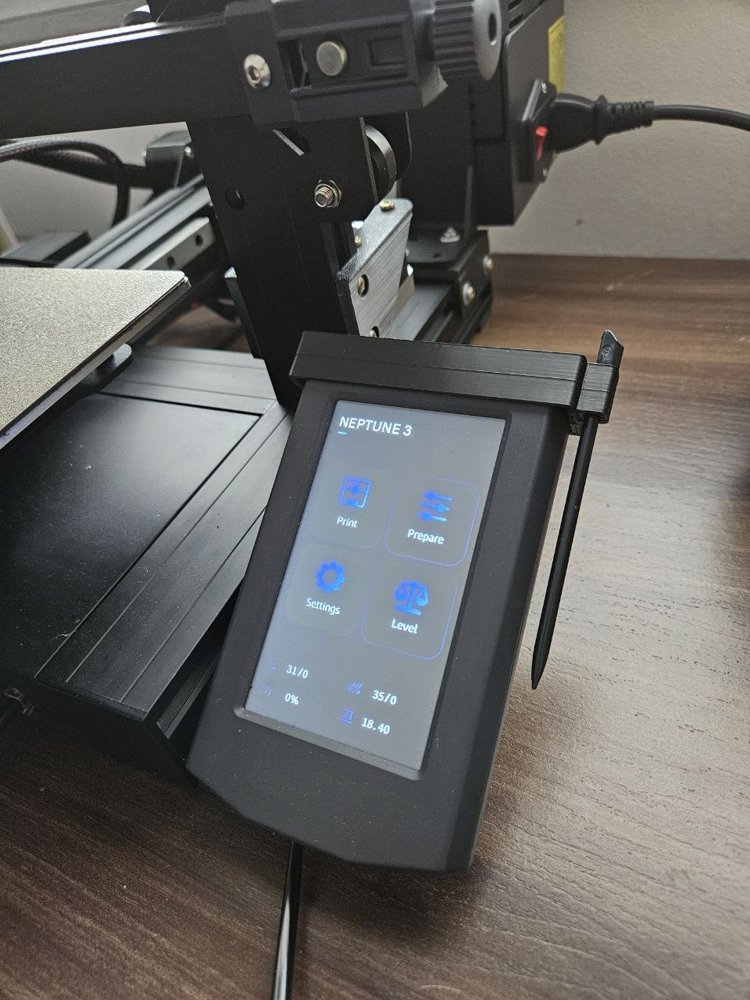

# Samsung Cell Phone Pen Holder

This repository contains the design files and instructions for 3D printing a pen holder for Samsung cell phones, designed to fit the display of an Elegoo Neptune 3 3D printer. It might also work for other models, but this has not been tested.

## Motivation

I frequently use the cell phone pen on the Neptune 3's display, but it often falls into inaccessible areas or I end up losing the pen. So I designed this holder.

## Features

- **Compatibility:** Samsung cell phones with a pen (S Pen).
- **3D Printer:** Elegoo Neptune 3.
- **Recommended Material:** PLA, PETG, or ABS.

## Project Images

## Files

- `support_design.stl` - STL file for printing.
- `support_design.skp` - Sketchup file for editing.

## Printer Settings
   - Layer: 0.2 mm
   - Infill: 20%
   - Supports: Not required
   - Nozzle Temperature: 205°C (for PLA. Adjust as needed for other materials)
   - Bed Temperature: 60°C (for PLA. Adjust as needed for other materials)

## Contributions

Contributions are welcome! If you have improvements or corrections, feel free to open a pull request.

## License

This project is licensed under the CC (Creative Commons) License. Personal use, remixes, and commercialization are allowed, provided the source is cited.

## Contact

For questions or suggestions, open an issue in the repository or contact via email at [ricarm@gmail.com](mailto:ricarm@gmail.com).

---

Made with ❤️ by [Ricardo Mazzolli](https://github.com/illozzam)
